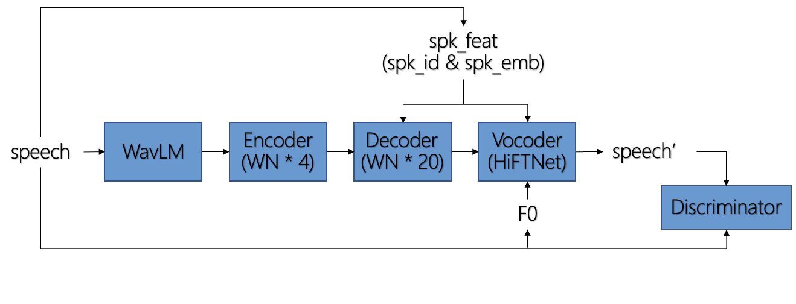
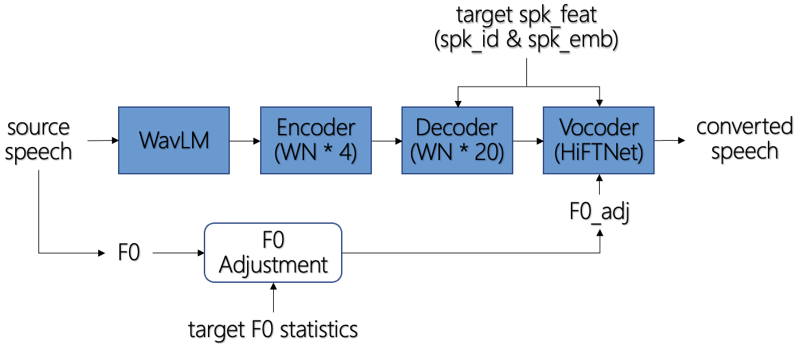
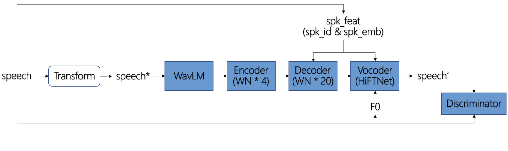
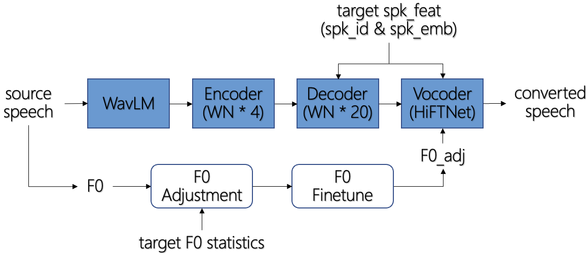

# Description

<table style="width:100%">
  <tr>
    <td></td>
    <td></td>
  </tr>
  <tr>
    <th>(a) Training</th>
    <th>(b) Inference</th>
  </tr>
  <tr>
    <td></td>
    <td></td>
  </tr>
  <tr>
    <th>(c) Training (w/ optional properties)</th>
    <th>(d) Inference (w/ optional properties)</th>
  </tr>
</table>

## Modules

**Encoder**: 4 [WN](https://github.com/jaywalnut310/vits/blob/2e561ba58618d021b5b8323d3765880f7e0ecfdb/modules.py#L111) layers

**Decoder**: 20 conditional [WN](https://github.com/jaywalnut310/vits/blob/2e561ba58618d021b5b8323d3765880f7e0ecfdb/modules.py#L111) layers

**Vocoder**: From [HiFTNet](https://github.com/yl4579/HiFTNet)

**Discriminator**: From [HiFTNet](https://github.com/yl4579/HiFTNet)

**F0 Adjustment**: Adjust F0 of source speech to suit the characteristics of target speaker

$$
\begin{align}
  lf0_{src} &= \ln(f0_{src}) \\
  lf0_{adj} &= lf0_{src} - mean(lf0_{src}) + \ln(mean(f0_{tgt})) \\
  f0_{adj} &= e^{lf0_{adj}} \\
\end{align}
$$

## Optional

**Transform**: [SR](https://github.com/OlaWod/FreeVC/blob/81c169cdbfc97ff07ee2f501e9b88d543fc46126/utils.py#L52)-based augmentation in an on-the-fly manner. Specify `use_aug: true` in `config_v1_16k.json` to enable this properties.

**F0 Finetune**: In some corner cases the $mean(lf0_{src})$ is inaccurate, which causes speaker dissimilarity of converted speech. This properties makes use of ASV model scores to automatically finetune the adjusted F0. Specify `--search` when using `convert_*.py` to enable this properties.
